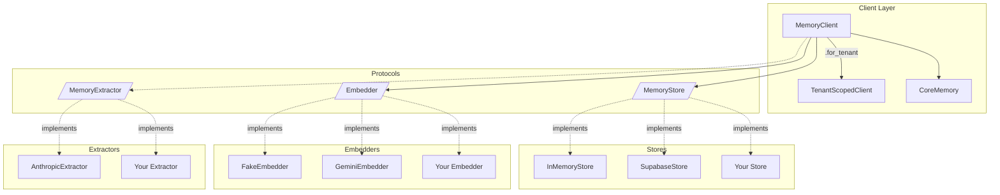
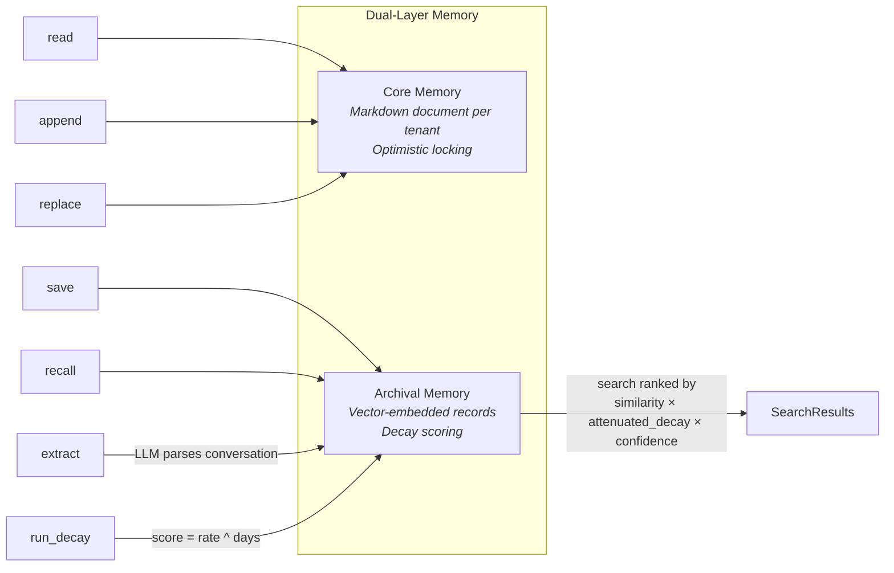

# cascade-memory

Pluggable memory system for AI agents — core memory, archival search with decay, and LLM-based extraction.

## Features

- **Dual-layer memory**: persistent core profile + searchable archival memory with vector embeddings
- **Multi-tenant**: every operation is tenant-scoped, with isolation enforced at the store level
- **Pluggable backends**: protocol-based design — swap stores, embedders, and extractors independently
- **Semantic recall**: cosine similarity search ranked by `similarity * (0.3 + 0.7 * decay) * confidence`
- **Time-based decay**: memories fade unless accessed — configurable decay rate
- **Memory linking**: Zettelkasten-style connections between memories
- **LLM extraction**: automatically extract facts from conversations (optional)
- **Core memory with optimistic locking**: structured markdown document per tenant, version-controlled

## Install

```bash
pip install cascade-memory @ git+https://github.com/thinklikeadesigner/cascade-memory.git
```

With optional backends:

```bash
pip install "cascade-memory[supabase] @ git+https://github.com/thinklikeadesigner/cascade-memory.git"
pip install "cascade-memory[gemini] @ git+https://github.com/thinklikeadesigner/cascade-memory.git"
pip install "cascade-memory[anthropic] @ git+https://github.com/thinklikeadesigner/cascade-memory.git"
pip install "cascade-memory[all] @ git+https://github.com/thinklikeadesigner/cascade-memory.git"
```

## Quick Start

```python
from cascade_memory import MemoryClient
from cascade_memory.stores.memory import InMemoryStore
from cascade_memory.embedders.fake import FakeEmbedder

client = MemoryClient(
    store=InMemoryStore(),
    embedder=FakeEmbedder(),
)

# Scope all operations to a tenant
tenant = client.for_tenant("user-123")

# Save a memory
memory_id = await tenant.save(
    "Prefers morning work blocks, low energy after 3pm",
    memory_type="preference",
    tags=["schedule", "energy"],
)

# Recall relevant memories
results = await tenant.recall("when does the user have energy?")
for r in results:
    print(f"{r.memory.content} (similarity: {r.similarity:.2f})")

# Core memory — persistent profile document
await tenant.core.append("User Profile", "- Timezone: PST")
await tenant.core.append("User Profile", "- Role: Backend engineer")
content, version = await tenant.core.read()
```

## Architecture





Everything is injected via protocols. No concrete backend is required at import time.

## Core Memory

A single markdown document per tenant, size-limited and version-controlled. Use it for the agent's persistent profile of a user.

```python
tenant = client.for_tenant("user-123")

# Append to a section (created if it doesn't exist)
await tenant.core.append("Working Patterns", "- Most productive on Tuesdays")
await tenant.core.append("Active Goals", "- Ship MVP by March")

# Read the full document
content, version = await tenant.core.read()
# Returns:
# ## Working Patterns
# - Most productive on Tuesdays
#
# ## Active Goals
# - Ship MVP by March

# Replace specific text
await tenant.core.replace("Ship MVP by March", "Ship MVP by April")

# Overwrite with optimistic locking
await tenant.core.overwrite(new_content, expected_version=version)
```

The default size limit is 3000 characters. Writes that exceed the limit raise `StoreLimitError`.

## Archival Memory

Searchable long-term memory with vector embeddings, decay scoring, and linking.

```python
tenant = client.for_tenant("user-123")

# Save
mid = await tenant.save("Had a great call with a PM from Stripe", tags=["outreach"])

# Recall (semantic search)
results = await tenant.recall("Stripe conversations", count=5, threshold=0.5)

# Update content (re-embeds automatically)
await tenant.update(mid, "Had a great call with Sarah, PM at Stripe")

# Soft delete (sets status to "forgotten", keeps the record)
await tenant.forget(mid)

# Hard delete
await tenant.delete(mid)

# Link memories together
await tenant.link(source_id=mid1, target_id=mid2, link_type="follow_up")
related = await tenant.get_related(mid1)
```

### Search Ranking

Results are ranked by: `similarity * (0.3 + 0.7 * decay_score) * confidence`

- **similarity**: cosine similarity between query embedding and memory embedding
- **decay_score**: starts at 1.0, decreases over time unless the memory is accessed
- **confidence**: set at save time (default 1.0), useful for extracted memories with varying certainty

The attenuated decay formula `(0.3 + 0.7 * decay_score)` ensures old memories are deprioritized but never fully killed. A fully decayed memory (decay_score=0) still retains 30% of its ranking weight, so a highly relevant old memory can still surface over a weakly relevant recent one.

### Decay

Memories decay over time unless accessed. Run decay periodically:

```python
updated_count = await client.run_decay()
```

The decay formula: `score = decay_rate ^ days_since_last_access` (default rate: 0.95).

Accessing a memory via `recall` automatically refreshes its `last_accessed_at` timestamp.

## LLM Extraction

Automatically extract facts from conversations and save them as memories:

```python
from cascade_memory.extractors.anthropic import AnthropicExtractor
import anthropic

client = MemoryClient(
    store=InMemoryStore(),
    embedder=GeminiEmbedder(api_key="..."),
    extractor=AnthropicExtractor(
        client=anthropic.AsyncAnthropic(api_key="..."),
    ),
)

tenant = client.for_tenant("user-123")

transcript = """
User: I just got back from Tokyo, it was amazing.
Assistant: How was the trip?
User: Great — I'm thinking of moving there next year. Also, I switched from React to Svelte for the new project.
"""

memory_ids = await tenant.extract(transcript)
# Saves: "User visited Tokyo and is considering relocating there next year"
# Saves: "User switched from React to Svelte for their current project"
```

The extractor skips small talk and transient details. Each extracted memory is self-contained.

## Backends

### Stores

| Store | Install | Use case |
|-------|---------|----------|
| `InMemoryStore` | included | Tests, prototyping, small-scale |
| `SupabaseStore` | `[supabase]` | Production with pgvector |

```python
from cascade_memory.stores.memory import InMemoryStore
from cascade_memory.stores.supabase import SupabaseStore

# In-memory (no setup needed)
store = InMemoryStore()

# Supabase (requires schema migration)
from supabase import create_client
sb = create_client(url, key)
store = SupabaseStore(sb)
```

The `SupabaseStore` expects three tables (`core_memories`, `memories`, `memory_links`) and two RPC functions (`match_memories`, `update_memory_decay_scores`). See the SQL schema section below.

### Embedders

| Embedder | Install | Dimensions | Use case |
|----------|---------|------------|----------|
| `FakeEmbedder` | included | configurable (default 768) | Tests, local dev |
| `GeminiEmbedder` | `[gemini]` | 768 | Production (free tier available) |

```python
from cascade_memory.embedders.fake import FakeEmbedder
from cascade_memory.embedders.gemini import GeminiEmbedder

# Fake (deterministic, hash-based)
embedder = FakeEmbedder(dimensions=768)

# Gemini
embedder = GeminiEmbedder(api_key="...", model="gemini-embedding-001")
```

### Extractors

| Extractor | Install | Use case |
|-----------|---------|----------|
| `AnthropicExtractor` | `[anthropic]` | Production extraction with Claude |

```python
from cascade_memory.extractors.anthropic import AnthropicExtractor
import anthropic

extractor = AnthropicExtractor(
    client=anthropic.AsyncAnthropic(api_key="..."),
    model="claude-haiku-4-5-20251001",  # default
)
```

## Custom Backends

Implement the protocols to add your own backends:

```python
from cascade_memory.protocols.store import MemoryStore
from cascade_memory.protocols.embedder import Embedder
from cascade_memory.protocols.extractor import MemoryExtractor

class MyStore:
    """Implement the MemoryStore protocol."""
    async def save(self, tenant_id, memory): ...
    async def search(self, tenant_id, embedding, count, threshold): ...
    # ... (see protocols/store.py for full interface)

class MyEmbedder:
    """Implement the Embedder protocol."""
    async def embed(self, text: str) -> list[float]: ...
    async def embed_batch(self, texts: list[str]) -> list[list[float]]: ...

    @property
    def dimensions(self) -> int: ...

class MyExtractor:
    """Implement the MemoryExtractor protocol."""
    async def extract(self, conversation_text: str) -> list[ExtractedMemory]: ...
```

Protocols use structural typing — no base class inheritance required.

## Data Models

```python
from cascade_memory import MemoryRecord, SearchResult, MemoryLink

# What gets stored
MemoryRecord(
    id="...",
    content="User prefers mornings",
    memory_type="preference",        # "fact", "preference", "pattern", etc.
    tags=["schedule"],
    confidence=1.0,
    decay_score=1.0,                 # decreases over time
    status="active",                 # "active" or "forgotten"
    embedding=[0.1, 0.2, ...],       # vector (optional)
)

# What recall() returns
SearchResult(
    memory=MemoryRecord(...),
    similarity=0.85,                 # cosine similarity
    rank_score=0.85,                 # similarity * (0.3 + 0.7*decay) * confidence
)

# Connections between memories
MemoryLink(
    id="...",
    source_id="mem-1",
    target_id="mem-2",
    link_type="follow_up",
)
```

## Error Handling

```python
from cascade_memory import (
    CascadeMemoryError,       # base exception
    StoreLimitError,          # core memory size limit exceeded
    ConcurrencyError,         # core memory version conflict
    MemoryNotFoundError,      # memory ID doesn't exist
    TenantIsolationError,     # cross-tenant access attempted
    EmbeddingError,           # embedding generation failed
    ExtractionError,          # LLM extraction failed to parse
    DimensionMismatchError,   # embedding dimensions don't match store
)
```

By default, embedding failures are non-fatal — memories save without vectors. Set `require_embedding=True` on `MemoryClient` to make them raise `EmbeddingError`.

## Supabase Schema

If using `SupabaseStore`, apply this schema to your database. Replace `DIMS` with your embedder's output dimensions (e.g., 768 for Gemini, 1536 for OpenAI `text-embedding-3-small`).

```sql
-- Enable pgvector
create extension if not exists vector;

-- Core memory (one document per tenant)
create table core_memories (
    tenant_id text primary key,
    content text not null default '',
    version integer not null default 1,
    updated_at timestamptz default now()
);

-- Archival memories
create table memories (
    id uuid primary key default gen_random_uuid(),
    tenant_id text not null,
    content text not null,
    memory_type text not null default 'fact',
    tags text[] default '{}',
    confidence float default 1.0,
    decay_score float default 1.0,
    status text default 'active',
    embedding vector(DIMS),  -- match your embedder's dimensions
    superseded_by uuid references memories(id),
    source_id text,
    created_at timestamptz default now(),
    last_accessed_at timestamptz default now(),
    last_confirmed_at timestamptz
);

create index on memories (tenant_id, status);

-- Memory links
create table memory_links (
    id uuid primary key default gen_random_uuid(),
    tenant_id text not null,
    source_memory_id uuid not null references memories(id),
    target_memory_id uuid not null references memories(id),
    link_type text not null,
    created_at timestamptz default now()
);

-- Semantic search function
create or replace function match_memories(
    query_embedding vector(DIMS),
    match_tenant_id text,
    match_count int default 5,
    match_threshold float default 0.5
) returns table (
    id uuid, content text, memory_type text, tags text[],
    confidence float, decay_score float, status text,
    embedding vector(DIMS), superseded_by uuid, source_id text,
    created_at timestamptz, last_accessed_at timestamptz,
    last_confirmed_at timestamptz, similarity float
) language plpgsql as $$
begin
    return query
    select
        m.id, m.content, m.memory_type, m.tags,
        m.confidence, m.decay_score, m.status,
        m.embedding, m.superseded_by, m.source_id,
        m.created_at, m.last_accessed_at, m.last_confirmed_at,
        1 - (m.embedding <=> query_embedding) as similarity
    from memories m
    where m.tenant_id = match_tenant_id
      and m.status = 'active'
      and m.embedding is not null
      and 1 - (m.embedding <=> query_embedding) > match_threshold
    order by (1 - (m.embedding <=> query_embedding)) * (0.3 + 0.7 * m.decay_score) * m.confidence desc
    limit match_count;
end;
$$;

-- Decay function
create or replace function update_memory_decay_scores(p_decay_rate float default 0.95)
returns integer language plpgsql as $$
declare
    updated integer;
begin
    with decayed as (
        update memories
        set decay_score = power(p_decay_rate, extract(epoch from (now() - last_accessed_at)) / 86400.0)
        where status = 'active'
          and last_accessed_at is not null
        returning 1
    )
    select count(*) into updated from decayed;
    return updated;
end;
$$;
```

> **Note:** The production migration template at `src/cascade_memory/stores/migrations/001_memory.sql.template` uses `{embedding_dimensions}` as a placeholder and includes additional indexes and constraints. Use it for automated deployments.

## Testing

```bash
pip install "cascade-memory[dev] @ git+https://github.com/thinklikeadesigner/cascade-memory.git"
pytest
```

All tests use `InMemoryStore` + `FakeEmbedder` — no external services required.

## License

MIT
